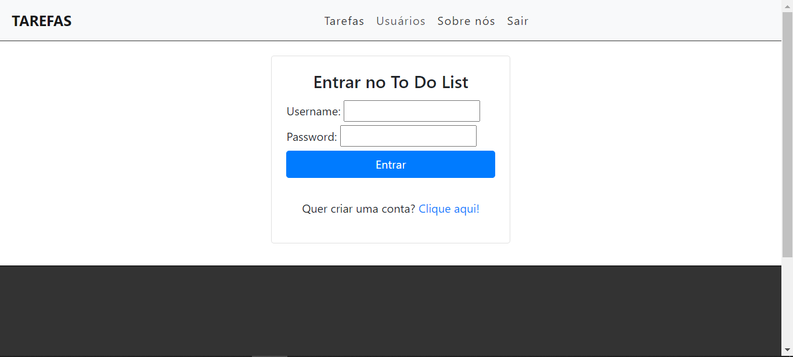
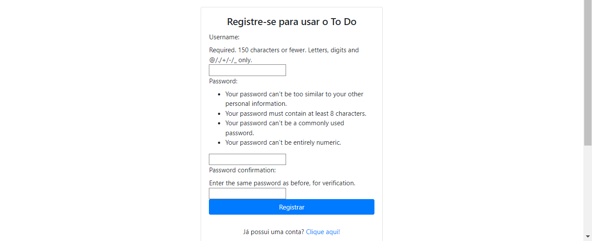
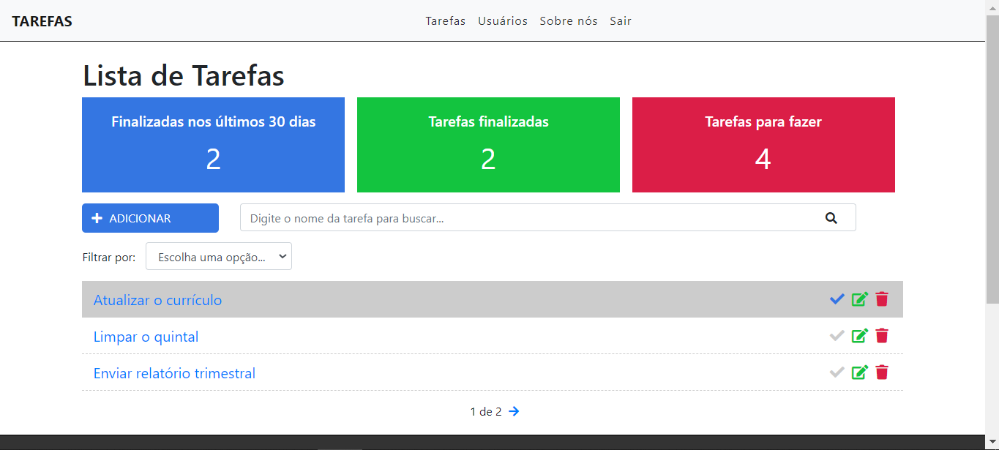
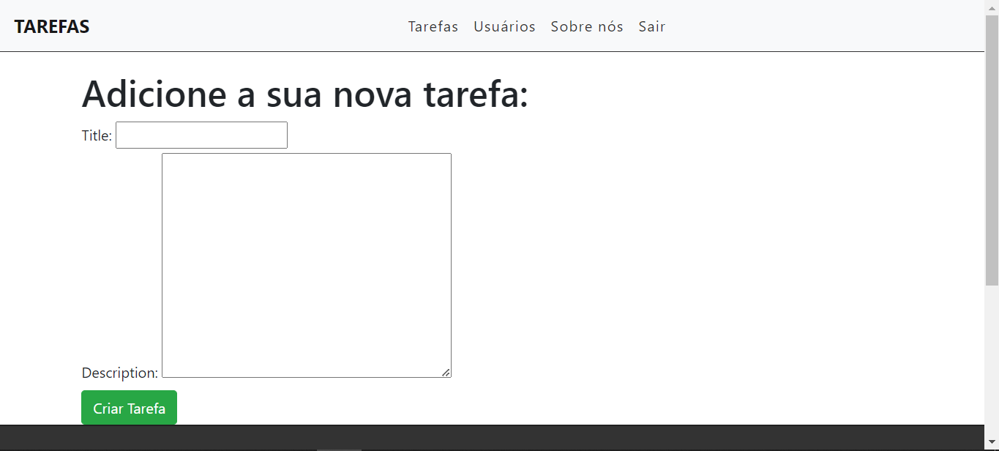
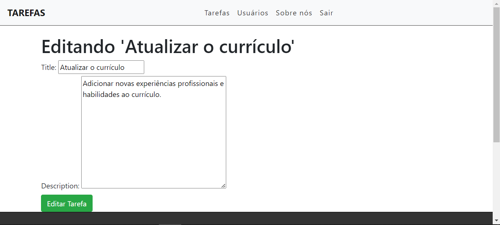
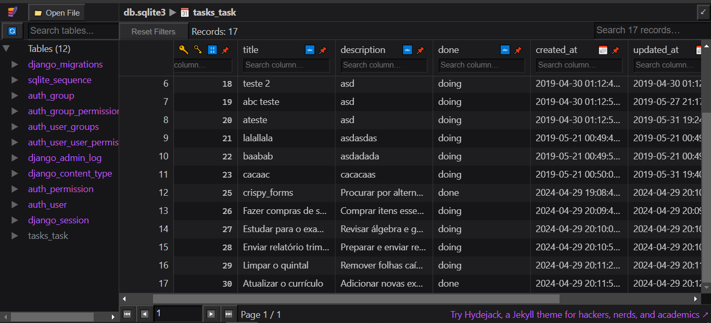

# LISTA DE TAREFAS COM DJANGO
👨‍🏫PROJETO CRIADO PARA O CURSO DE DJANGO!

 <br> 
 <br> 
 <br> 
 <br> 
 <br> 
 <br> 

## DESCRIÇÃO:
- Este aplicativo de CRUD de tarefas com SQLite e Django permite que cada usuário gerencie sua própria lista de tarefas de forma segura e eficiente. 

- Os usuários podem criar, visualizar, atualizar e excluir suas próprias tarefas. Cada tarefa possui um título e descrição. 

## RECURSOS:
1. **Registro de Usuário:** Os usuários têm a opção de se registrar para uma nova conta no aplicativo. O formulário de registro solicita informações básicas do usuário, como nome de usuário, endereço de e-mail e senha.

2. **Login de Usuário:** O aplicativo permite que os usuários façam login em suas contas pessoais. Cada usuário tem acesso apenas às suas próprias tarefas e não pode visualizar as tarefas de outros usuários.

3. **Lista de Tarefas:**
   - A lista de tarefas é dividida em diferentes seções, exibindo o número de tarefas concluídas nos últimos 30 dias, o total de tarefas concluídas e o número de tarefas a serem feitas.
   - Os usuários têm a opção de adicionar uma nova tarefa clicando no botão "ADICIONAR", que os redireciona para a página de criação de tarefas.
   - Um campo de pesquisa permite aos usuários buscar tarefas pelo seu título.
   - Um filtro permite aos usuários filtrar as tarefas por status, mostrando apenas as tarefas concluídas ou as que ainda estão em progresso.
   - Mensagens de feedback são exibidas aos usuários, como alertas de sucesso ou erro após a realização de uma ação.
   - Cada tarefa é exibida como um item na lista, mostrando o título da tarefa e oferecendo opções para editar, excluir ou marcar a tarefa como concluída.
   - A paginação é implementada para exibir um grande número de tarefas de forma organizada, permitindo que os usuários naveguem entre as páginas conforme necessário.

## EXECUTANDO O PROJETO:
1. **Instalando as dependências:**
   Antes de executar o aplicativo, certifique-se de instalar todas as dependências necessárias. No terminal, execute o seguinte comando para instalar as dependências listadas no arquivo `requirements.txt` no diretório: `CODIGO`:
   ```bash
   pip install -r requirements.txt
   ```

2. **Executando o Aplicativo:**
   - Em seguida, execute o seguinte comando para iniciar o servidor Django:
   ```bash
   python manage.py runserver
   ```
   - Uma vez que o servidor esteja em execução, você poderá acessar o aplicativo através do seu navegador, visitando o seguinte endereço: `http://localhost:8000/`.
   
3. **Interagindo com o Aplicativo:**
   1. **Registro de Usuário:**
      - Para começar a usar o aplicativo, os usuários precisam se registrar. Eles podem acessar a página de registro clicando em `Clique aqui` no formulário de Login (Na sessão de "Quer criar uma conta?").
      - Na página de registro, os usuários devem preencher um formulário com seu nome de usuário, endereço de e-mail e senha. Depois de preencher o formulário, eles podem clicar no botão "Registrar" para criar uma conta.

   2. **Login:**
      - Depois de registrar uma conta, os usuários podem fazer login no aplicativo clicando no link "Entrar" no menu de navegação. Eles devem inserir seu nome de usuário (`admin@admin.com`) e senha (`12345678top`) e, em seguida, clicar no botão "Entrar".

   3. **Adicionar Tarefas:**
      - Após fazer login, os usuários podem começar a adicionar tarefas clicando no botão "ADICIONAR" na página de lista de tarefas.
      - Na página de criação de tarefas, os usuários devem preencher um formulário com o título da tarefa e uma descrição opcional. Depois de preencher o formulário, eles podem clicar no botão "Criar" para adicionar a tarefa à lista.

   4. **Visualizar e Gerenciar Tarefas:**
      - Os usuários podem visualizar todas as suas tarefas na página de lista de tarefas. Cada tarefa é exibida como um item na lista, mostrando o título da tarefa e seu status (concluída ou em progresso).
      - Para editar uma tarefa, os usuários podem clicar no ícone de lápis ao lado da tarefa desejada. Isso os levará à página de edição de tarefas, onde podem modificar o título ou a descrição da tarefa.
      - Os usuários também podem excluir uma tarefa clicando no ícone de lixeira ao lado da tarefa desejada.
      - Para marcar uma tarefa como concluída, os usuários podem clicar no ícone de marca de seleção ao lado da tarefa desejada.

   5. **Filtrar e Pesquisar Tarefas:**
      - Os usuários têm a opção de filtrar suas tarefas por status, mostrando apenas as tarefas concluídas ou as que ainda estão em progresso.
      - Eles também podem pesquisar tarefas pelo título usando o campo de pesquisa na parte superior da página de lista de tarefas.

   6. **Logout:**
      - Quando os usuários terminarem de usar o aplicativo, eles podem fazer logout clicando no link "Sair" no menu de navegação.
   
## TECNOLOGIAS UTILIZADAS:
- [**Python**:](https://github.com/VILHALVA/CURSO-DE-PYTHON) Python é uma linguagem de Programação.
  
- [**Django:**](https://github.com/VILHALVA/CURSO-DE-DJANGO) Um framework web de alto nível baseado em Python, que simplifica o desenvolvimento de aplicativos web complexos.
  
- [**SQLite:**](https://github.com/VILHALVA/CURSO-DE-SQLITE) Um sistema de gerenciamento de banco de dados relacional leve e eficiente, amplamente utilizado para desenvolvimento de aplicativos web.
  
- [**Python com SQLITE**:](https://github.com/VILHALVA/CURSO-DE-PYTHON-COM-SQLITE) Python é uma linguagem de Programação, enquanto SQLite é um banco de dados.

- [**Bootstrap:**](https://github.com/VILHALVA/CURSO-DE-BOOTSTRAP) Um framework front-end popular para desenvolvimento de interfaces de usuário responsivas e estilizadas.

## CREDITOS:
- [PROJETO FEITO PELO VILHALVA](https://github.com/VILHALVA)
- [CURSO DE FEITO PARA O CURSO DE DJANGO](https://github.com/VILHALVA/CURSO-DE-DJANGO)


